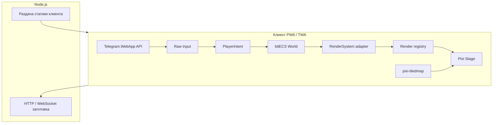

# Архитектура MVP: 2D RPG для Telegram Web Apps

Цель: изометрический «вайб» Diablo 2 на ортогональной сетке с минимальным боем и лутом. Клиент — **mobile-first** (тапы + опционально стрелки на десктопе). Сервер — **Node.js** для будущей авторитативности; на этапе MVP допустим **клиент-авторитет** с валидацией там, где это дёшево.

## Стек и роли

| Слой | Технология | Роль |
|------|------------|------|
| Рендер | [PixiJS v8](https://pixijs.com/) (последний стабильный `pixi.js` на npm) | WebGL / WebGPU, `Application`, Assets, сцена, интерактив |
| Логика сущностей | [bitECS](https://github.com/NateTheGreatt/bitECS) | ECS: позиции, HP, теги, запросы в системах |
| Карта | [**pixi-tiledmap**](https://www.npmjs.com/package/pixi-tiledmap) | Загрузка `.tmj` / Tiled JSON под Pixi v8, слои → display tree |
| Ассеты MVP | `assets/` | Урезанный набор: одна карта, тайлсеты по ссылкам из `.tmj` |
| Полный пак | `full-assets/` | Источник для расширения; не тащить в бандл целиком |

## Связка ECS ↔ рендер (адаптер, не жёсткий 1:1)

**Правило:** слой ECS **не импортирует** типы Pixi и не держит ссылки на `DisplayObject`. Вместо «один `eid` = один спрайт навсегда» используется косвенная связь.

**Компонент (пример):** `RenderRef { renderId }` — непрозрачный идентификатор (число / UUID) записи в **реестре представлений** снаружи ECS (`Map<renderId, Container | Graphics>` или пул узлов). Один `eid` может иметь несколько `RenderRef` (тень + тело + оружие), либо несколько сущностей с общим визуальным корнем — на выбор команды; важно, что ECS знает только `renderId`.

**`RenderSystem`** (или несколько: `RenderSyncSystem`, `RenderLifecycleSystem`) — **адаптер** и по сути **единственное место клиентского кода, где импортируется и мутируется Pixi** (плюс фабрика создания узлов для реестра). Читает `Position`, `Health`, флаги видимости и т.д., обновляет или пересоздаёт узлы в реестре по `renderId`. При смене скина, `destroy()` спрайта или пулинге — меняется только реестр и при необходимости новое значение `renderId` в компоненте; движение и бой не трогают `sprite` напрямую.

**Зачем:** несколько визуальных элементов на сущность, пересоздание спрайта без пересоздания `eid`, скрытие / замена вида без протекания API рендера в боевую логику.

## Ввод: Input → Intent

Сырые события (тап, стрелки, pointer) **не** напрямую двигают игрока и **не** сразу наносят урон. Отдельный слой собирает кадр (или тик) в структуру **намерения**:

```ts
// Пример формы; поля опциональны по кадру
type PlayerIntent = {
  moveTo: { x: number; y: number } | null       // десктоп: куда идти (цель в мире)
  moveDirection: { x: number; y: number } | null // мобила: нормализованное направление от тапа
  attackTarget: number | null                    // eid цели или null (bitECS entity id)
}
```

Сборщик ввода выставляет **либо** целевую точку, **либо** направление (см. таблицу desktop/mobile и правило **остановки** движения на мобиле в [implementation-plan.md](./implementation-plan.md)). **Системы решения** (порядок фиксирован): проверка валидной атаки по `attackTarget`; иначе движение по `moveDirection` или к `moveTo`. Так проще добавлять `USE_ITEM`, приоритеты, станы, GUI без переписывания низкоуровневого ввода.

## Высокоуровневая схема



## Клиент: слои приложения

1. **Bootstrap TWA** — `Telegram.WebApp.ready()`, размер viewport, отключение зума страницы при необходимости, CSS `100dvh` / safe-area.
2. **Asset pipeline** — расширения **pixi-tiledmap** для `Assets` в Pixi v8; файлы под **`public/assets/`**, в `.tmj` и тайлсетах — пути **с префиксом `/assets/`** и `fetch('/assets/map.tmj')` без кастомного basePath (см. [implementation-plan.md](./implementation-plan.md), фаза 2.1).
3. **Карта** — через **pixi-tiledmap**: визуальные слои `ground`, `wall`; слой `collisions` скрыть (в Tiled или `visible = false` на контейнере слоя). Массив `data` слоя `collisions` читать для **физики** (или экспортировать отдельный буфер при загрузке).
4. **ECS-мир** — отдельный объект `gameWorld` (не путать с `createWorld` из bitECS — можно назвать `ecsWorld`). Компоненты в SoA: **`Position { x, y }` в мировых пикселях** (как Tiled), `Velocity`, `Health`, `Hitbox`, флаги `Player`, `Enemy`, `Loot`, `Dead` и т.д. Тайлы — только через `floor` при проверке сетки (см. [implementation-plan.md](./implementation-plan.md)).
5. **Системы (порядок тика)** — фиксированный pipeline; время из тикера (`deltaMS` → секунды или нормализация к 16.67 ms — см. план имплементации):
   - сырой ввод → агрегация **`PlayerIntent`** (`moveTo`, `moveDirection`, `attackTarget`);
   - **разрешение намерения** → движение / атака / бездействие;
   - движение + разрешение коллизий с сеткой;
   - применение урона и кулдаунов;
   - смерть врага → спавн лута;
   - **`RenderSystem`**: синхронизация реестра представлений по `RenderRef` + `Position` и др.;
   - камера (след за игроком, clamp к границам карты).

## Коллизии (MVP)

Текущая карта (`assets/map.tmj`): ортогональная сетка **32×32**, слой **`collisions`** — тайлы с ненулевым gid трактуются как **непроходимые** (например gid `30` по всему периметру и препятствиям).

Алгоритм:

- **Игрок / враг / лут** — ось-выровненный **AABB** в **мировых пикселях** (квадрат в мире = один размер, например 24×24 с отступом от клетки).
- **Доступ к сетке:** `isBlockedTile(tx, ty)`; после смещения — проверка **четырёх углов** хитбокса → тайлы через `floor(world / tileSize)` (детали в плане имплементации).
- **Ввод:** один перевод **screen → world** с учётом камеры и `worldScale`, чтобы клики и `Position` были в одной системе.
- **Разрешение:** часто пробное смещение по X, затем по Y с откатом оси; в углах возможны застревание и дрожание — при необходимости сеточный шаг или мелкие подшаги (см. план имплементации).
- Альтернатива позже: object layer с полигонами — не нужна для MVP с квадратами.

## Бой и лут (MVP)

- **Атака:** тап → мировые координаты → в **`PlayerIntent`** выставить `attackTarget` или поля движения. Урон только если одновременно: цель **живая** (`Enemy`, не `Dead`), **дистанция \< attackRange**, **кулдаун** (порядка 300 ms) истёк — иначе без урона.
- **Смерть:** `Health <= 0` → компонент `Dead`, отключение коллизии врага, удаление/скрытие спрайта → создать сущность лута в той же позиции.
- **Лут:** один тип (например «монета») — квадрат другого цвета; подбор при пересечении с игроком (или тап по луту — на мобиле удобнее авто-подбор при касании).

## Сервер Node.js (MVP и рост)

**MVP:** сервер раздаёт статику (Vite build / `dist`) и опционально JSON health. Игровое состояние полностью на клиенте (**клиент-авторитет** — допустимо для одиночного MVP).

**Заложить сразу (античит-мышление, даже без логики на сервере):**

- не принимать с клиента «голый» урон или смерть цели как истину; в проде урон считает сервер по своему `ATTACK` и таблицам;
- не принимать произвольные телепорты позиции; в проде `MOVE` валидируется по скорости, dt, коллизиям с миром сервера;
- клиент может **отображать** предикт, но канон — версия сервера (когда появится).

**Единый контракт событий игрока** — завести типы/enum и очередь на клиенте уже в MVP (хотя бы `console` или no-op отправитель), чтобы потом тот же payload уйти по WebSocket:

| Событие | Назначение (смысл для будущего сервера) |
|---------|----------------------------------------|
| `MOVE` | намерение сместиться (цель, направление или снапшот ввода — уточнить схему; сервер проверяет допустимость) |
| `ATTACK` | намерение ударить цель `targetId` (сервер проверяет дистанцию, кулдаун, LOS) |
| `USE_ITEM` | использование предмета слота (сервер проверяет наличие, кулдаун, контекст) |

Тела сообщений — отдельные TypeScript-типы в общем пакете `shared/` или `packages/protocol/`, чтобы клиент и Node использовали одни и те же имена полей.

**Следующий шаг:** WebSocket; сервер хранит комнату, принимает только эти события, валидирует, рассылает снапшоты. ECS на сервере без Pixi (те же компоненты-числа).

## Telegram Web Apps — обязательные учёты

- **Viewport:** `Telegram.WebApp.expand()` при старте; слушать `viewportChanged` для ресайза canvas.
- **Жесты:** не перехватывать вертикальный скролл всей страницы — canvas на весь экран, `touch-action: none` на контейнере игры.
- **Клавиатура:** стрелки — для десктопа / внешней клавиатуры; на телефоне основной ввод — **виртуальный джойстик** или **тап по клетке / в направлении** (для MVP достаточно: тап = идти в сторону тапа или короткий шаг по сетке).
- **Безопасность:** позже — проверка `initData` на сервере для привязки прогресса; в MVP не блокер.

## Структура репозитория (рекомендация)

```
game-rpg/
  apps/client/          # Vite + TypeScript + Pixi + bitECS
  apps/server/          # express/fastify, static + API
  assets/               # карта и тайлсеты для сборки клиента
  full-assets/          # полный ассет-пак, не в бандл
  docs/                 # эта документация
```

Монорепо не обязателен: можно начать с одного `client/` и `server/` в корне.

## Риски и смягчение

| Риск | Смягчение |
|------|-----------|
| Версии **pixi.js** и **pixi-tiledmap** | Ставить последние совместимые релизы одной командой (`npm i pixi.js pixi-tiledmap`); при регрессии — зафиксировать пары версий в lockfile |
| Пути в `.tmj` | Все URL от корня сайта с префиксом `/assets/`; зеркало на диске `public/assets/` |
| Двойной источник правды (клиент/сервер) | С первого дня проектировать `MOVE` / `ATTACK` / `USE_ITEM` и недоверие к «результату» с клиента; при появлении сервера — он авторитетен для позиций и урона |

## Ссылки

- [PixiJS](https://pixijs.com/) — рендер; целевая ветка **v8** ([релизы](https://github.com/pixijs/pixijs/releases)).
- [pixi-tiledmap](https://github.com/riebel/pixi-tiledmap) / [npm](https://www.npmjs.com/package/pixi-tiledmap) — Tiled для Pixi v8, `.tmj` и внешние тайлсеты.
- [bitECS](https://github.com/NateTheGreatt/bitECS) — минимальный data-oriented ECS для TypeScript.
- Формат карт Tiled; расширение `.tmj` — тот же JSON, что у `.json`.
